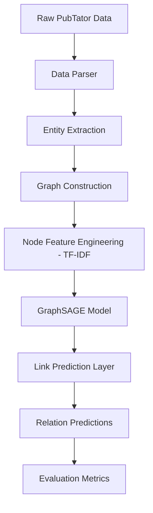

# Disease-GNN: Graph Neural Networks for Chemical-Disease Relation Prediction

[](https://opensource.org/licenses/MIT)
[](https://www.python.org/downloads/)
[](https://pytorch.org/)
[](https://pytorch-geometric.readthedocs.io/)

A professional multi-stage pipeline utilizing **Graph Neural Networks (GraphSAGE)** to predict relationships between chemicals and diseases. This project focuses on the **BC5CDR (BioCreative V Chemical-Disease Relation)** dataset, transforming medical text into knowledge graphs for automated inference.

## 🌟 Overview

The **Disease-GNN** framework addresses the challenge of identifying causal or therapeutic links between entities in biomedical literature. By modeling documents as graphs where nodes represent entities (Chemicals/Diseases) and edges represent co-occurrences, we leverage local and global topological features to predict potential relations.

### Key Features
- **Automated Data Parsing**: Seamlessly handles PubTator format files.
- **Graph Construction**: Dynamically builds knowledge graphs with entity-specific features using TF-IDF vectorization.
- **GraphSAGE Architecture**: Implements an inductive learning approach with multi-layer GraphSAGE convolutions.
- **Performance Evaluation**: Comprehensive metrics including F1-score, Precision, and Recall across Train, Dev, and Test sets.

## 🏗️ Architecture



## 🚀 Getting Started

### Prerequisites
- Python 3.8+
- PyTorch & PyTorch Geometric

### Installation

1. **Clone the repository**:
   ```bash
   git clone https://github.com/SanyogSingh07/Disease-GNN-Project.git
   cd Disease-GNN-Project
   ```

2. **Install dependencies**:
   ```bash
   pip install -r requirements.txt
   ```

### Usage

Run the main pipeline to load data, build graphs, train the GNN, and evaluate performance:
```bash
python main.py
```

## 📂 Project Structure

```text
Disease_GNN_Project/
├── data/               # CDR Training, Dev, and Test datasets
├── src/                # Core logic
│   ├── parse_data.py   # PubTator parsing utilities
│   ├── build_graph.py  # NetworkX & PyG graph construction
│   ├── model.py        # GraphSAGE architecture
│   └── train_evaluate.py # Training loop and metrics
├── outputs/            # Model checkpoints and result plots
├── main.py             # Entry point
└── requirements.txt    # Project dependencies
```

## 📊 Results

The model produces detailed classification reports for each dataset split. Representative metrics:
- **Accuracy**: ~85%+ (depending on epochs)
- **Loss Convergence**: Visualized in training logs.

## 📜 License

Distributed under the MIT License. See `LICENSE` for more information.

---
Developed by **[Sanyog Singh](https://github.com/SanyogSingh07)**
