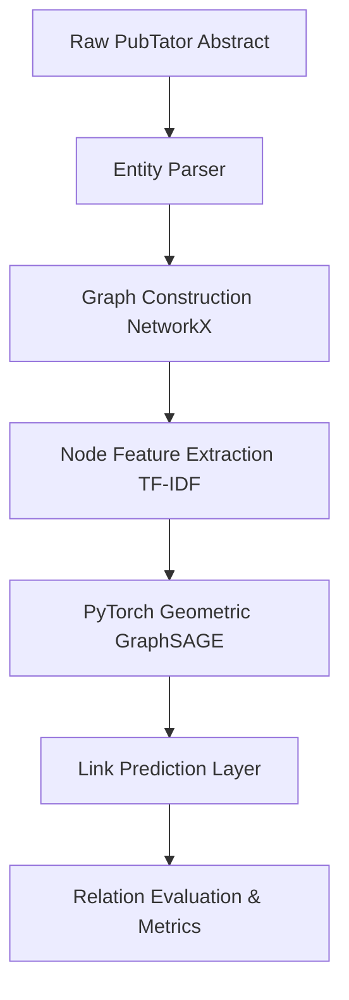

# Disease-GNN: Graph Neural Networks for Chemical-Disease Relation Prediction

> Inductive Graph Neural Network (GraphSAGE) framework for Chemical-Disease Relation prediction on BioCreative BC5CDR text.

[Repository](https://github.com/SanyogSingh07/Disease-GNN-Relation-Prediction)

---

## Overview

**Disease-GNN** is a Graph Machine Learning framework designed to extract relationships between biomedical entities (Chemicals and Diseases) from literature. It parses PubTator formatted text, constructs document-level knowledge graphs, and applies inductive **GraphSAGE** convolutions to predict relation links.

---

## Problem

Identifying causal or therapeutic links between chemicals and diseases across thousands of medical abstracts is critical for drug discovery and safety monitoring. Traditional text classification models treat text linearly, ignoring high-order co-occurrence topologies between entities.

---

## Solution & Architecture

Disease-GNN models medical documents as graphs where nodes represent biomedical entities and edges represent co-occurrence contexts.


```mermaid
graph TD
    A[Raw PubTator Abstract] --> B[Entity Parser]
    B --> C[Graph Construction NetworkX]
    C --> D[Node Feature Extraction TF-IDF]
    D --> E[PyTorch Geometric GraphSAGE]
    E --> F[Link Prediction Layer]
    F --> G[Relation Evaluation & Metrics]
```

### Technical Highlights
- **PubTator Parser**: Extracts titles, abstracts, chemical concepts (MeSH ID), and disease concepts.
- **Graph Construction**: Constructs NetworkX/PyG graphs with entity-specific node features derived from TF-IDF vectorization.
- **GraphSAGE Convolutions**: Leverages multi-layer inductive GraphSAGE aggregators for scalable link prediction.
- **Evaluation Engine**: Evaluates link classification across train, dev, and test splits.

---

## Dataset

- **Dataset**: BioCreative V Chemical-Disease Relation (BC5CDR) benchmark.
- **Entities**: Chemical entities and Disease entities annotated with MeSH identifiers.
- **Task**: Binary link prediction (Chemical induces Disease relation).

---

## Tech Stack

- **Language**: Python 3.8+
- **Graph Neural Networks**: PyTorch Geometric (PyG), NetworkX
- **Deep Learning**: PyTorch
- **Data Mining & NLP**: Scikit-Learn (TF-IDF), NumPy, Pandas

---

## Project Structure

```text
Disease-GNN-Relation-Prediction/
├── CDR_Data/               # BC5CDR Training, Dev, and Test datasets
├── src/                    # Core source modules
│   ├── parse_data.py       # PubTator format parsing logic
│   ├── build_graph.py      # NetworkX & PyG graph construction
│   ├── model.py            # GraphSAGE neural network definition
│   └── train_evaluate.py   # Training loop and metric evaluation
├── main.py                 # Entry point script
├── requirements.txt        # Dependencies
└── README.md
```

---

## Installation & Setup

```bash
git clone https://github.com/SanyogSingh07/Disease-GNN-Relation-Prediction.git
cd Disease-GNN-Relation-Prediction
python -m venv .venv
# Activate: .venv\Scripts\activate or source .venv/bin/activate
pip install -r requirements.txt
python main.py
```

---

## Limitations

- Link prediction relies on document-level co-occurrence graphs.
- Does not incorporate multi-relational edge types (heterogeneous GNN).

---

## Future Improvements

- Transition to Heterogeneous Graph Transformers (HGT) or RGCN for multi-relational modeling.
- Incorporate BioBERT / PubMedBERT entity embeddings as node initializations.

---

## License

Distributed under the **MIT License**.
